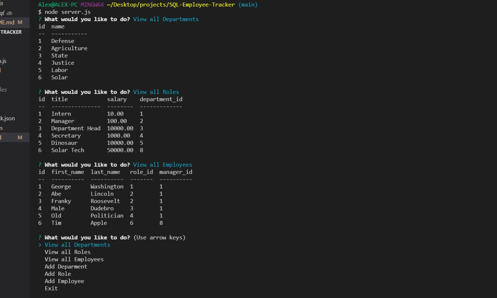

# SQL-Employee-Tracker

# Challenge 12 - SQL Employee Tracker

## Purpose
As a small business owner, I want to be able to write and save notes to help organize and keep track of my tasks.

## Built With
* JavaScript
* Inquirer
* JSON
* Node.js
* MySQL
* MySQL2
* console.table

## Requirements/Notes
* AS A business owner
* I WANT to be able to view and manage the departments, roles, and employees in my company
* SO THAT I can organize and plan my business

## Github Link
https://github.com/christenson10/SQL-Employee-Tracker.git
## Video Link
https://www.youtube.com/watch?v=uJIa_LrtU7k

## README Preview 1
3 View All Functions

## README Preview 2
localhost:3001 takes to Note Taker

## README Preview 3
localhost:3001/notes takes you to text boxes
